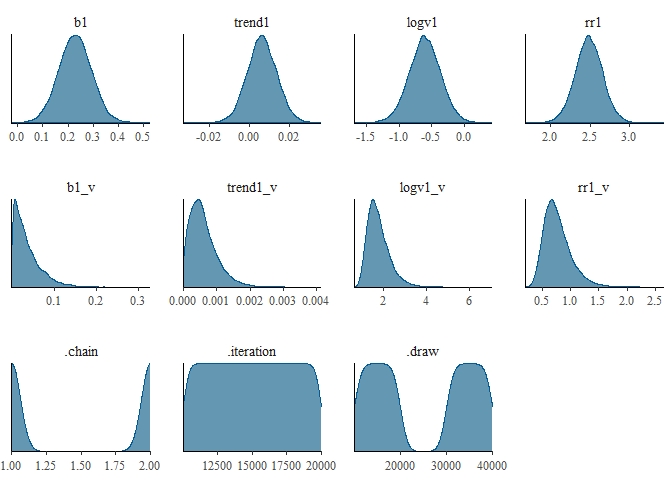
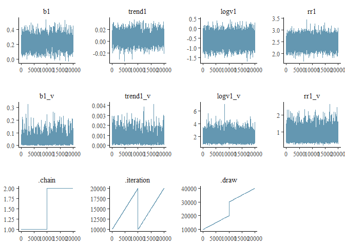

# Homework 8
Anh Dao
2024-12-02

- [Research question:](#research-question)
- [Variables](#variables)
  - [Data Import](#data-import)
  - [Variable Summary](#variable-summary)
  - [Mplus code](#mplus-code)
- [Results](#results)

# Research question:

Does reward consumption increase throughout CBT and ACT group therapy?

The current study aims to assess group and individual trajectories of
change of reward consumption following cognitive behavioral therapy
(Beck, 1979) and acceptance and commitment therapy (ACT; Hayes et al.,
1999).

# Variables

- ‘rr1’: Reward consumption “I found it enjoyable/fulfilling to do
  things.”

  - Scale: 1= Not at All; 2 = A Little; 3 = Moderately; 4 = Quite a Bit;
    5 = Extremely

  - Note that this variable is ordinal, but the model cannot run if we
    set ORDINAL = RR1. The distribution of responses does not show
    ceiling/floor effects, and based on the skewness and kurtosis, it
    may be safe to run the analysis with the assumption that RR1 is
    continuous.

- ‘time’: Assessment instance

- ‘Beta1’: Autoregressive effect of reward consumption

- ‘trend1’: Effect of time on reward consumption

- ‘logV1’: Log variance of reward consumption

- ‘\_v’: Represents variance of each parameter

## Data Import

## Variable Summary

Table **?@tbl-summ-var** shows the summary statistics of reward
consumption.

|     |           | All   |
|-----|-----------|-------|
| rr1 | N         | 622   |
|     | Mean      | 2.62  |
|     | SD        | 1.22  |
|     | Min       | 1.00  |
|     | Max       | 5.00  |
|     | Histogram | ▆▇▆▆▂ |

Model

Let L be the intercept, D the autoregressive effect, Time the time
trend, and e the residual variance.

Within:

}} + \delta_{Rew_{tj}}\\
  \end{aligned}")

Prior:

 \\
    \ D_{Rew_{j}} & \sim \Gamma^{-1}(1, 0.01) \\
    \ Time_{tj} & \sim \Gamma^{-1}(-1, 0.50) \\
    \ e_{Rew_{tj}}  & \sim \Gamma^{1}(1.5, 0.20) \\
  \end{aligned}")

Analysis

We used 2 chains, each with 20,000 iterations (first 10,000 as
warm-ups).

## Mplus code

    TITLE:  RIPTIDE

    DATA:
      FILE IS "C:\Users\anhdao\OneDrive - Vanderbilt\Desktop\RIPTIDE Data\
      data_mech_mplus.csv";

    VARIABLE:
      NAMES ARE record group no  instance qol_td pro_phq cr1 cr2
        cr3 ba1 ba2 ba3 ps acc mind sac def val ca dist supp avoid rum ss cc1 cc2   
        cc3 rr1 rr2 pf1 pf2 pf3 er aveact actskill se affect1 affect2
        affect3 affect4 affect5 affect6 affect7 affect8 affect9 affect10
        na pa phq1 phq2 phq3 phq4 phq5 phq6 phq7 phq8 phq9; 
      USEVARIABLES ARE record rr1 time;
      WITHIN = time;
      MISSING IS .;
      CLUSTER IS record; 
      LAGGED=rr1(1);
      TINTERVAL = no(1); 
    DEFINE: 
      time=no;
      
    ANALYSIS:
      TYPE = TWOLEVEL RANDOM; 
      ESTIMATOR = BAYES; 
      BITERATIONS = (20000); 
      PROCESSORS =2;
      CONVERGENCE = 0.005;

    MODEL:
      %WITHIN%  
        BETA1  | rr1^ ON rr1^1;  
        trend1 | rr1 ON time; 
        LogV1 | rr1;           

       %BETWEEN%
       [rr1]; 
       [BETA1];
       [LogV1];
       [trend1]; 
       
       rr1; 
       BETA1; 
       LogV1; 
       trend1;

    OUTPUT: 
      tech1 tech8 cinterval(hpd) standardized (cluster);
    SAVEDATA:
      SAVE = FSCORES(200);
      PREDICTORS = ytilde;        ! Save posterior predictive values (simulated values)
      FILE = rew573_pred.dat; 
      PLOT: TYPE = PLOT3 DRIFT (0, 5, 0.1);

# Results

**?@tbl-summ** shows the posterior distributions.

| variable |  mean | median |   sd |  mad |    q5 |   q95 | rhat | ess_bulk | ess_tail |
|:---------|------:|-------:|-----:|-----:|------:|------:|-----:|---------:|---------:|
| b1       |  0.23 |   0.23 | 0.07 | 0.06 |  0.12 |  0.34 | 1.00 |  1176.73 |  2761.91 |
| trend1   |  0.01 |   0.01 | 0.01 | 0.01 | -0.01 |  0.02 | 1.00 |   917.84 |  3088.03 |
| logv1    | -0.61 |  -0.61 | 0.24 | 0.24 | -1.00 | -0.21 | 1.00 |  2303.03 |  7205.21 |
| rr1      |  2.49 |   2.49 | 0.17 | 0.17 |  2.20 |  2.77 | 1.00 |  3022.08 |  9137.04 |
| b1_v     |  0.04 |   0.03 | 0.03 | 0.03 |  0.00 |  0.10 | 1.00 |   405.29 |   900.92 |
| trend1_v |  0.00 |   0.00 | 0.00 | 0.00 |  0.00 |  0.00 | 1.01 |   420.54 |   468.60 |
| logv1_v  |  1.75 |   1.66 | 0.53 | 0.46 |  1.08 |  2.73 | 1.00 |  1469.87 |  3686.30 |
| rr1_v    |  0.77 |   0.73 | 0.25 | 0.21 |  0.45 |  1.23 | 1.00 |  4255.28 |  8203.45 |

As shown in the rank histogram in
<a href="#fig-rank-hist-fit" class="quarto-xref">Figure 1</a> below, the
chains mixed well.

Figure 1: Rank histogram of the posterior distributions of model
parameters.

The analysis showed that on average, group participants’ reward
consumption did not change significantly over time with a posterior mean
of 0.04 and a 90% CI of \[0, 0.1\].
